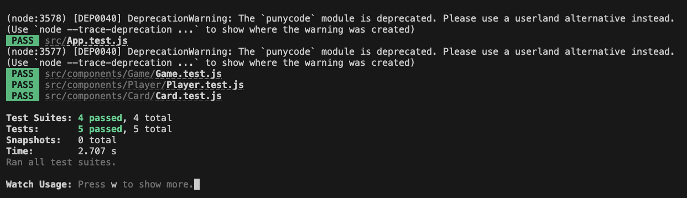

# React card-game App

Click here to view [Card Game](https://rpateld.github.io/card-game/).

## About the App

This application is a card game where players draw cards with the goal of getting as close to a total of 25 without going over. The game starts with a shuffled deck of cards. Players, which can include a mix of humans and computers, take turns drawing a card from the deck. The drawn card's value is added to the player's total score and displayed on the screen. If a player's total score exceeds 25, they lose. Once all cards are drawn, or all players have ended their turns, the player with the score closest to 25 without going over wins. If there's a tie, the player with more cards wins. The game includes features to draw a card, display the current highest score, and reset the game.

## Project Structure

The project is organized as follows:

- `card-game/`: This is the root directory of the application.
    - `node_modules/`: This directory contains all the dependencies of the project.
    - `public/`: This directory contains static files.
        - `index.html`: The main HTML file that is loaded when the app is accessed.
        - `favicon.ico`: The icon that is displayed in the browser tab.
        - `manifest.json`: The web app manifest which provides information about the application.
    - `src/`: This directory contains all the source code for the React application.
        - `components/`: This directory contains all the reusable components.
            - `Game/`: This directory contains the Game component and its test file.
                - `index.js`: The Game component.
                - `Game.test.js`: The test file for the Game component.
            - `Player/`: This directory contains the Player component and its test file.
                - `index.js`: The Player component.
                - `Player.test.js`: The test file for the Player component.
            - `Card/`: This directory contains the Card component and its test file.
                - `index.js`: The Card component.
                - `Card.test.js`: The test file for the Card component.
        - `App.js`: This is the main component of the application.
        - `App.test.js`: The test file for the App component.
        - `index.js`: This is the entry point of the application.
    - `package.json`: This file contains the list of project dependencies and scripts.
    - `package-lock.json`: This file is automatically generated for any operations where npm modifies either the node_modules tree, or package.json.
    - `README.md`: This file contains information about the project and instructions on how to use it.

## How to Use

To use this app, follow these steps:

1. Clone the repository to your local machine.
2. Navigate to the project directory.
3. Run `npm install` to install all the dependencies.
4. Run `npm start` to start the development server. Open [http://localhost:3000](http://localhost:3000) to view it in your browser.

## Testing

This project uses Jest for testing. To run the tests, use the command `npm test`. This launches the test runner in the interactive watch mode.

## Building and Deployment

To build the app for production, run `npm run build`. This command builds the app for production to the `build` folder. It correctly bundles React in production mode and optimizes the build for the best performance.

The build is minified and the filenames include the hashes. Your app is ready to be deployed!

For more information about deployment, see the section about [deployment](https://facebook.github.io/create-react-app/docs/deployment).
